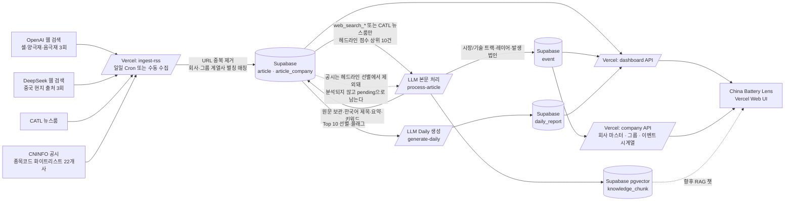
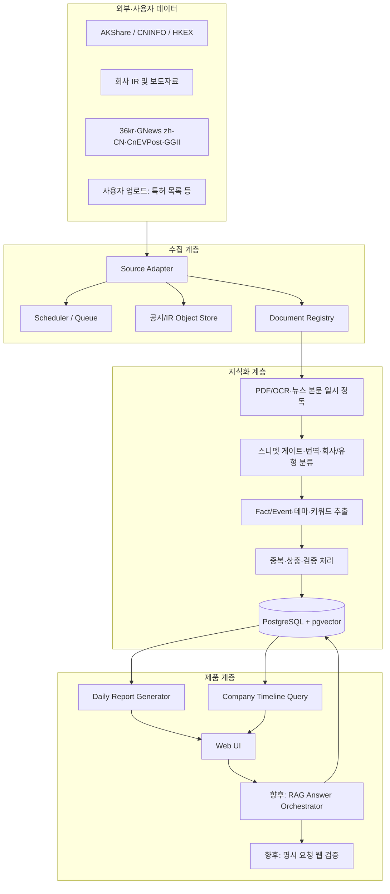

# 시스템 설계

> 이 문서에는 초기 설계와 목표 구조가 함께 있다. 현재 배포 구현은 `docs/HANDOFF.md`와 `architecture/current-architecture.svg`를 우선한다.

## 1. 설계 개요

수집, 정독·번역, 집계, 제품 제공 계층을 분리한다. 사이트별 수집 방식이나 LLM 공급자 변경은 내부 Adapter로 흡수한다. 이 설계는 소스 추가와 모델 교체가 화면과 분석 로직에 전파되지 않게 하며, MVP는 GitHub Actions·Supabase·Vercel의 무료 티어에서 시작한다.

## 2. 논리 아키텍처

### 현재 구현 아키텍처

수집은 공개 트리거를 허용하고, 비용이 발생하는 본문 LLM 처리·Daily 생성은 Vercel Cron의 `CRON_SECRET` 인증 요청에서만 실행한다. 뉴스 원문은 사용자의 명시 요구로 `article.body_original`에 보관하며 청킹·임베딩에 사용한다. 본문 교차검증은 `pass` / `corrected_pass` / `reject` 세 단계다. 일부 오류를 제거하고 의미 있는 사실이 남는 `corrected_pass`는 검증자가 다시 작성한 기사·이벤트 필드만 저장하며, 확인 가능한 사실이 전혀 없거나 회사와 무관할 때만 기사 전체를 기각한다.

RSS 수집기는 웹 검색 방식으로 전환하면서 호출이 끊겨 제거했다. 실제 수집 경로는 위 네 가지다.

CNINFO 공시는 수집·저장되지만 `selectHeadlineTop10()`이 `web_search_*`와 CATL 뉴스룸만 선별 대상으로 삼기 때문에 본문 분석과 `event` 생성에 들어가지 않는다. 공식 공시를 최우선 출처로 둔다는 제품 원칙과 어긋나는 지점이며 `docs/HANDOFF.md` 9절에 기술부채로 올려 두었다.

## 3. 주요 Module과 Interface

| Module | Interface | 책임 |
| --- | --- | --- |
| Source Adapter | `discover(cursor)`, `fetch(item)` | 소스별 인증·페이지네이션·다운로드 차이를 감춤 |
| Document Registry | `register(rawDocument)` | 원문 해시, 중복, 버전, 회사 후보를 관리 |
| Knowledge Extractor | `extract(document)` | 텍스트·Fact·Event·인용 위치와 시장/기술 시계열 분류를 생성 |
| Event Resolver | `resolve(candidateEvents)` | 동일 이벤트 병합, 상충 표기, 신뢰도 산정 |
| Report Generator | `generate(date, scope)` | 우선순위 이벤트 기반 일일 리포트 생성 |
| Answer Orchestrator | `answer(question, context)` | 내부 검색, 필요시 웹 대조, 인용 답변 생성 |

## 4. 소스·영속화 정책

| 데이터 | MVP 소스 | 영속 저장 | 주의 사항 |
| --- | --- | --- | --- |
| 시세·재무 | AKShare | 일별·분기 수치 | 상류 포맷 변경에 백오프·캐시 |
| A주 공시 | CNINFO | PDF/텍스트·메타데이터 | 요청 속도 제어, 비정형 PDF |
| H주 공시 | HKEXnews | PDF/텍스트·메타데이터 | 공식 검색·PDF 활용 |
| 뉴스 | 36kr, GNews zh-CN, CnEVPost | 제목·링크·매체·한국어 요약 | 본문은 처리 뒤 폐기 |
| 보조 뉴스 | GGII, WeChat 公众号 | 헤드라인/허용된 요약 | 불안정하므로 보조 역할 |
| 수동 자료 | 특허·캐파·출하 파일 | 조직 권한 파일 | 비상장 재무·유료 원데이터 보완 |

유료 뉴스·공시 API는 승인 전 자동 수집하지 않는다. 무료 RSS와 공식 IR/공시 페이지를 우선 사용한다.

## 5. 처리 흐름

1. Scheduler가 Source Adapter에 증분 탐색을 요청한다.
2. 뉴스는 스니펫 게이트와 중복 클러스터링을 거쳐 통과 기사만 본문을 일시 취득한다. 공시·IR은 원문과 메타데이터를 저장한다.
3. 신규 또는 변경 문서만 텍스트 추출, 한국어 번역, 지식화를 수행하며 뉴스 본문은 완료 후 폐기한다.
4. Extractor가 인용 가능한 문장 범위와 함께 Fact/Event 후보를 만든다.
5. Resolver가 기존 이벤트와 비교하여 생성·갱신·상충 상태를 결정한다.
6. Event는 `market`, `technology`, 또는 `both` 시계열 트랙을 갖는다. 시장·기술의 방향은 모델이 판단하지 않고 출처에 명시된 팩트로만 표시한다.
7. 일일 리포트는 해당일 변경 이벤트와 중요도 점수를 입력으로 생성한다.
8. 챗 기능은 Phase 3 후보이며, 착수 시 검색된 근거 없이는 답변을 확정하지 않고 명시 요청 시에만 웹 확인을 수행한다.

## 6. 중요도 산정

`importance = 0.30 × materiality + 0.20 × certainty + 0.15 × novelty + 0.15 × competitiveImpact + 0.10 × financialImpact + 0.10 × sourceReliability`

각 항목은 0~100으로 정규화한다. 수치가 명시된 공식 공시, 확정된 계약·가동·실적은 높은 certainty를 부여한다. 초기에는 규칙 기반으로 운영하고, 사용자 피드백을 학습 데이터로 축적해 조정한다.

## 6.1 시장/기술 2축 뷰

기업 페이지는 시장 트랙(가격·마진·출하·수주·캐파·가동·고객·지역·재무)과 기술 트랙(화학계·공정·성능·특허·표준·개발·인증·양산·출하)을 분리해 같은 시간축에 배치한다. 목적은 두 트랙의 디커플링과 기술 신호에서 시장 결과로 이어지는 리드-래그를 사용자가 직접 읽게 하는 것이다. 시스템은 “기술 피벗”, “시장 악화”처럼 해석을 확정하지 않고, 검증 가능한 이벤트와 수치만 제시한다.

## 7. 보안·권한·컴플라이언스

- 공시·IR 저장소는 비공개로 운영하며, 역할 기반 접근 제어를 적용한다.
- 사용자 업로드 문서는 테넌트/조직 단위로 격리한다.
- 외부 뉴스 본문은 영속 저장·외부 재배포하지 않고, LLM 정독에만 일시 전달한다.
- 모든 답변에 데이터 기준 시각과 출처 목록을 기록한다.

## 8. 권장 구현 스택

- Web UI: Next.js + TypeScript on Vercel
- Ingestion: Python + GitHub Actions 일일 실행
- Database/Auth/Storage: Supabase PostgreSQL + Auth OTP + Storage
- Workflow: `daily.yml`, `workflow_dispatch`, `pipeline_runs`로 멱등성 관리
- Vector search: 챗 기능 착수 때 Supabase pgvector 추가
- Parsing: PDF text extraction, Chinese OCR, HTML normalization
- Observability: structured logs, ingestion metrics, document failure queue
