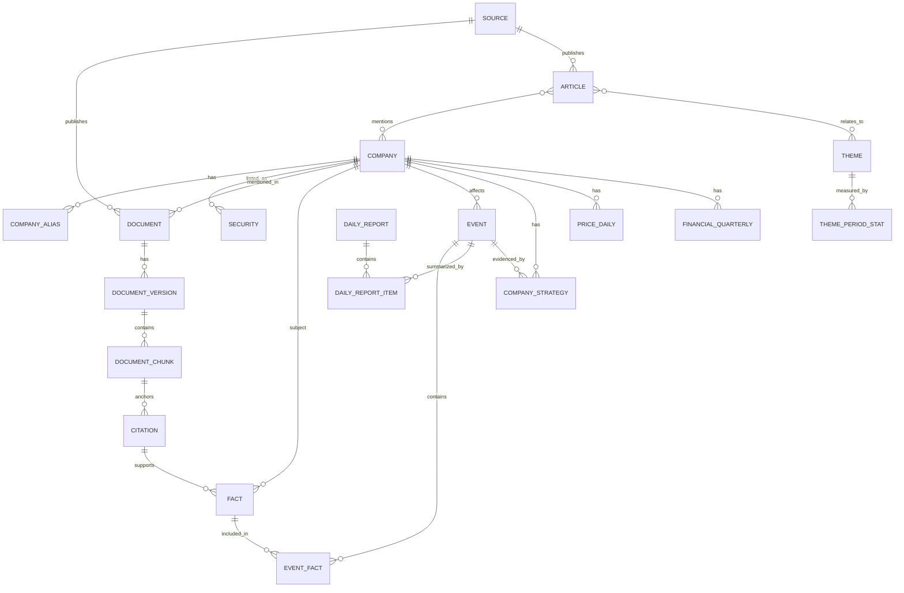

# 데이터 모델과 지식화 규칙

> 현재 운영 Supabase 스키마는 `supabase/schema.sql`, 구현 차이는 `docs/HANDOFF.md`를 우선한다.

## 1. 핵심 원칙

공시·IR Document는 보존 가능한 출처 기록이다. 뉴스 Article은 제목·링크·발행일·매체·자체 한국어 요약과 접근통제된 원문을 보관한다. 원문은 청킹·임베딩·팩트 대조에 사용하며 외부에 재배포하지 않는다. Fact는 정독 또는 공시 추출에서 얻은 원자적 주장이고, Event는 여러 Fact와 출처를 묶어 보여주는 사업상 변화다.

## 2. 엔터티 관계

## 3. 테이블 정의

| 테이블 | 핵심 필드 | 설명 |
| --- | --- | --- |
| `company` | `id`, `name_ko`, `name_zh`, `name_en`, `type_tags`, `listed_status` | 기업의 정규 식별자와 복수 유형 태그 |
| `company_alias` | `company_id`, `alias`, `language`, `alias_type` | 중문·영문 약칭, 브랜드, 자회사, 구 명칭을 정규 기업 ID에 연결 |
| `event` | `id`, `company_id`, `trajectory_track`, `market_layer`, `occurred_at`, `source_url`, `original_excerpt`, `original_excerpt_ko` | 시장 이벤트는 4개 비교 레이어 중 하나를 보유; 원문 발췌·한국어 번역·출처 링크를 함께 보존 |
| `security` | `company_id`, `exchange`, `ticker`, `security_type` | 상장 코드와 시장 |
| `source` | `id`, `name`, `source_type`, `base_url`, `trust_tier` | 거래소·회사·매체·사용자 소스 |
| `document` | `id`, `source_id`, `canonical_url`, `content_hash`, `published_at` | 논리적 원문 |
| `document_version` | `document_id`, `storage_key`, `content_type`, `extracted_text`, `fetched_at` | 원문 파일과 추출본 버전 |
| `document_chunk` | `version_id`, `ordinal`, `text`, `embedding` | 검색·인용 단위 |
| `citation` | `chunk_id`, `char_start`, `char_end`, `page_number` | 정확한 근거 위치 |
| `article` | `source_id`, `title`, `url`, `published_at`, `summary_ko`, `body_fetched`, `cluster_id` | 뉴스 메타데이터와 자체 요약; 본문은 미저장 |
| `article_company` | `article_id`, `company_id`, `category` | 뉴스와 기업의 다대다 매핑 |
| `review_queue` | `candidate_id`, `review_status`, `evidence_policy`, `source_requirement`, `timeline_eligibility` | 정독 전 후보와 시점별 출처 정책·시계열 검수 상태 |
| `report_digest` | `parse_quality`, `visual_pages`, `renewed_at`, `renewal_status`, `renewal_inserted`, `source_sha256` | PDF 텍스트 전용/이미지 검토 필요 상태, 큰 이미지 의심 페이지, 원문 재다운로드·재분석 이력 |
| `ingestion_run` | `id`, `generated_at`, `candidate_count`, `payload_hash` | 매일 수집 JSON 스냅샷의 실행 이력 |
| `candidate_observation` | `ingestion_run_id`, `candidate_id`, `observed_on` | 어떤 후보가 어느 일일 수집에서 관측됐는지 보존 |
| `fact` | `subject_company_id`, `predicate`, `value_json`, `occurred_at`, `confidence` | 예: “CATL-계획생산능력-XX GWh” |
| `event` | `company_id`, `event_type`, `trajectory_track`, `occurred_at`, `status`, `importance_score` | 사용자에게 보여주는 변화 단위; `market`/`technology`/`both` 트랙 |
| `event_fact` | `event_id`, `fact_id`, `role` | 이벤트와 근거 Fact 연결 |
| `daily_report` | `report_date`, `scope`, `model_version`, `status` | 일일 리포트 헤더 |
| `daily_report_item` | `report_id`, `event_id`, `rank`, `summary_ko` | 리포트 문단과 이벤트 연결 |
| `company_strategy` | `company_id`, `theme`, `assessment`, `valid_from`, `valid_to` | 근거 기반 전략 해석 |
| `theme` | `name_ko`, `name_zh`, `approval_status` | 관리자 승인 테마 |
| `theme_period_stat` | `theme_id`, `period`, `strength`, `data_origin` | `seeded`/`measured` 테마 추이 |
| `keyword_period_stat` | `keyword`, `period`, `strength`, `data_origin` | 키워드 추이 |
| `price_daily` | `security_id`, `trading_date`, `close`, `market_cap` | 일별 시세·시가총액 |
| `financial_quarterly` | `company_id`, `period_end`, `metric`, `value`, `currency` | 분기 재무 수치 |
| `manual_metric` | `company_id`, `metric`, `value`, `period`, `source_upload_id` | 캐파·출하량·특허 등 수동 지표 |
| `user_document` | `organization_id`, `name`, `storage_key`, `access_scope` | 특허 목록 등 사용자 자료 |
| `pipeline_run` | `source_id`, `started_at`, `status`, `cursor`, `error` | 수집 실행·실패 격리 기록 |
| `rag_evaluation` | `subject_type`, `chunk_id`, `question_key`, `result_rank`, `verdict`, `issue_tags`, `evaluator` | 벡터 지식의 사람 평가. 청크 품질(`chunk`)과 질문별 검색 정밀도(`retrieval`)를 나눠 기록하며, 파이프라인은 읽지 않는다 |

## 4. 표준 분류 체계

### 산업 구분

- `cell`: 배터리 셀·팩 제조사
- `cathode`: 양극활물질 제조사; `cathode_ncm`, `cathode_lfp`, `cathode_lmfp` 보조 태그 허용
- `anode`: 음극활물질 제조사; `anode_graphite`, `anode_silicon` 보조 태그 허용

### 이벤트 유형

- `financial_result`, `guidance`, `capex`, `capacity_plan`, `plant_operation`
- `customer_contract`, `joint_venture`, `mna`, `product_launch`, `technology`
- `patent`, `raw_material`, `pricing`, `policy`, `regulatory`, `risk`

### 시계열 트랙

- `market`: 가격·마진·출하·수주·생산능력·가동·고객·중국 내수/해외 지역·투자·재무
- `technology`: 화학계·소재·공정·성능·특허·표준, 그리고 출처가 명시한 개발·인증·양산·출하
- `both`: 기술 이벤트가 고객 인증·실제 출하 등 시장 팩트와 함께 명시된 경우. 하나의 Event와 출처를 공유해 두 트랙에 표시한다.

### 상태

- `announced`: 공식 발표 단계
- `under_construction`: 건설·준비 단계
- `operational`: 실제 가동 확인
- `cancelled_or_delayed`: 취소·연기 확인
- `disputed`: 신뢰 가능한 출처 간 내용 상충

## 5. 정규화 규칙

- 모든 날짜는 원문 날짜와 ISO 8601 정규화 날짜를 함께 저장한다.
- 통화는 원문 통화와 기준 통화 환산값을 별도 필드에 보관하며, 환율 기준일을 기록한다.
- 생산능력은 `value`, `unit`, `annualized`, `product_scope`로 저장한다. GWh와 톤을 같은 지표로 합산하지 않는다.
- LLM이 추출한 Fact와 뉴스 요약에는 `provider`, `model`, `prompt_version`, `confidence`, `generated_at`을 남긴다.
- 숫자·날짜·회사 매칭은 규칙 또는 검증 모델로 재확인하고, 낮은 신뢰도는 검수 대기열로 보낸다.
- 트랙은 팩트의 유형으로 분류할 뿐, 향후 성과·기술 성숙도·전략 성공 여부를 추정하는 점수가 아니다.
- 뉴스의 과거 구간(발행 후 90일 초과)은 공식 공시·IR 우선으로 검수하고, 최근 90일은 회사 직접 발표 또는 복수 주요 언론/명시적 1차 출처 인용을 보강 근거로 허용한다. 후속 공식자료가 나오면 같은 Event의 근거를 갱신한다.

## 6. 향후 질의응답 검색 정책

1. 질문에서 기업, 기간, 주제, 비교 대상, 최신성 요구를 파악한다.
2. 구조화 Event/Fact를 먼저 검색하고, 관련 Document Chunk를 보강한다.
3. 최신성 기준을 벗어나거나 내부 근거가 없으면 허용된 외부 검색을 수행한다.
4. 답변의 각 핵심 주장에 Citation을 연결한다.
5. 상충된 출처는 하나를 임의로 선택하지 않고 차이를 설명한다.
