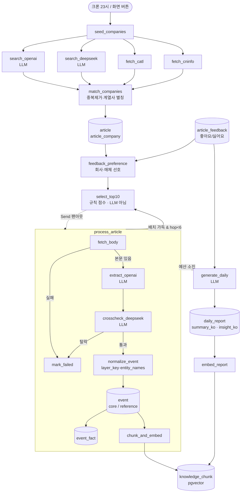

# China Battery Lens — LangGraph 표기 모델

기준일: 2026-09-04. 실제 런타임은 LangGraph가 아니라 Vercel 서버리스 함수 + `chainStage()` 훅 체이닝이다.
다만 구조가 LangGraph의 노드·조건부 엣지·`Send` 팬아웃과 1:1로 대응하므로, 흐름을 설명하는 표기법으로 쓴다.
각 노드에 대응 구현 파일을 주석으로 달았다.

그래프는 트리거가 다른 3개로 나뉜다.

| 그래프 | 트리거 | 목적 |
|---|---|---|
| A. `daily_ingest` | 크론 `0 14 * * *`(KST 23시), 화면 버튼 | 수집 → 선별 → 본문 검증 → 이벤트·벡터 → Daily |
| B. `curation` | `?curate_run=1`, 크론 딥런 | 정기보고서 정독·보강·웹 백필·시점 재확인 |
| C. `serve` | 사용자 요청 | 질의응답·비교 리포트 |

---

## 0. 공유 State

```python
from typing import Annotated, Literal, TypedDict
from operator import add

class IngestState(TypedDict):
    hop: int                       # chainStage 훅 번호
    deadline: float                # Vercel 60초 제약에서 남은 예산
    deep: bool                     # 크론이면 True(최대 6훅), 버튼이면 False(1훅)
    candidates: Annotated[list, add]   # 4경로 병렬 수집 결과가 여기로 합류
    articles: list                     # 저장된 article 행
    selected: list                     # Top 10
    events: Annotated[list, add]       # 팬아웃된 본문 처리 결과
    chunks: Annotated[list, add]
    report_date: str | None
```

`candidates`, `events`, `chunks`는 리듀서가 `add`다. 병렬 노드가 같은 키에 동시에 쓰기 때문이다.

---

## A. `daily_ingest`

### A-1. 노드 정의

```python
from langgraph.graph import StateGraph, START, END
from langgraph.types import Send

g = StateGraph(IngestState)

# --- 수집 ---
g.add_node("seed_companies",     seed_companies)      # api/ingest-rss.js  company upsert (31개사)
g.add_node("search_openai",      search_openai)       # lib/china-sources.js  검색 3회, 폭넓은 주요 출처
g.add_node("search_deepseek",    search_deepseek)     # lib/china-sources.js  검색 3회, 중국어 현지 출처
g.add_node("fetch_catl",         fetch_catl)          # lib/china-sources.js  CATL 뉴스룸
g.add_node("fetch_cninfo",       fetch_cninfo)        # lib/china-sources.js  CNINFO 공시 22개사
g.add_node("match_companies",    match_companies)     # companiesFor + groupAliases, URL 중복 제거
g.add_node("store_articles",     store_articles)      # article / article_company, source_tier 부여

# --- 선별 (LLM 아님: 결정적 규칙 점수 + 피드백 보정) ---
g.add_node("select_top10",       select_top10)        # selectHeadlineTop10()
                                                      # 신호 키워드 ±, 공시 +25, 최신성 감쇠,
                                                      # 그리고 feedbackPreference()의 회사·매체 선호 ±20

# --- 본문 처리 (기사별 팬아웃) ---
g.add_node("process_article",    process_article)     # api/process-article.js 서브그래프

# --- 리포트 ---
g.add_node("generate_daily",     generate_daily)      # api/generate-daily.js (+ article_feedback 100건)
g.add_node("feedback_preference", feedback_preference) # article_feedback 200건 → 회사·매체 선호 맵
g.add_node("embed_report",       embed_report)        # embedDailyReport()
```

### A-2. 엣지

```python
g.add_edge(START, "seed_companies")

# 4경로 병렬 수집. 리듀서가 candidates를 합친다.
for n in ("search_openai", "search_deepseek", "fetch_catl", "fetch_cninfo"):
    g.add_edge("seed_companies", n)
    g.add_edge(n, "match_companies")

g.add_edge("match_companies", "store_articles")
# 좋아요/싫어요는 기사 단위라 그대로는 다음 선별에 못 쓴다. 회사·매체 선호로 일반화해 점수에 더한다.
g.add_edge("store_articles", "feedback_preference")
g.add_edge("feedback_preference", "select_top10")

# Top 10을 기사 단위로 팬아웃한다. 실제로는 한 함수 안의 순차 루프지만
# 의미상 독립 작업이라 Send로 표기한다.
def fan_out_articles(state: IngestState):
    return [Send("process_article", {"article": a}) for a in state["selected"]]

g.add_conditional_edges("select_top10", fan_out_articles, ["process_article"])

# 훅 예산이 남고 이번 배치가 가득 찼으면 다음 훅으로 이어 붙인다(chainStage).
def next_hop(state: IngestState) -> Literal["select_top10", "generate_daily"]:
    batch_was_full = len(state["selected"]) >= 10
    return "select_top10" if state["deep"] and batch_was_full and state["hop"] < 6 else "generate_daily"

g.add_conditional_edges("process_article", next_hop, ["select_top10", "generate_daily"])
g.add_edge("generate_daily", "embed_report")
g.add_edge("embed_report", END)
```

### A-3. `process_article` 서브그래프

여기가 그림에서 빠져 있던 부분이다. 통과/탈락을 가르는 분기가 둘 있다.

```python
p = StateGraph(ArticleState)

p.add_node("fetch_body",        fetch_body)          # 원문 HTML (공시는 PDF 경로)
p.add_node("extract_openai",    extract_openai)      # 한국어 사실·이벤트 1차 추출
p.add_node("crosscheck_deepseek", crosscheck_deepseek)  # 같은 본문 재검증
p.add_node("normalize_event",   normalize_event)     # layer_key 8종 정규화 + entity_names 병기
p.add_node("write_event",       write_event)         # event 테이블
p.add_node("extract_facts",     extract_facts)       # lib/fact-extraction.js → event_fact
p.add_node("chunk_and_embed",   chunk_and_embed)     # 1800자/180자 중첩 → knowledge_chunk
p.add_node("mark_failed",       mark_failed)         # body_unavailable / body_too_short / processing_failed

p.add_edge(START, "fetch_body")

def has_body(s) -> Literal["extract_openai", "mark_failed"]:
    return "extract_openai" if s["body_ok"] else "mark_failed"

p.add_conditional_edges("fetch_body", has_body, ["extract_openai", "mark_failed"])
p.add_edge("extract_openai", "crosscheck_deepseek")

# 교차검증 통과 여부. 통과하면 article.verification_status = pending_review(=자동 팩트체크 통과).
def verified(s) -> Literal["normalize_event", "mark_failed"]:
    return "normalize_event" if s["crosscheck_passed"] else "mark_failed"

p.add_conditional_edges("crosscheck_deepseek", verified, ["normalize_event", "mark_failed"])

# 근거 등급 분기. 공시는 core로 강제, 단일 제3자 언론 기사는 core 불가(reference).
def eligibility(s) -> Literal["write_event", "chunk_and_embed"]:
    return "chunk_and_embed" if s["timeline_eligibility"] == "exclude" else "write_event"

p.add_conditional_edges("normalize_event", eligibility, ["write_event", "chunk_and_embed"])
p.add_edge("write_event", "extract_facts")
p.add_edge("extract_facts", "chunk_and_embed")
p.add_edge("chunk_and_embed", END)
p.add_edge("mark_failed", END)
```

### A-4. Mermaid



---

## B. `curation`

훅마다 하나씩 골라 처리하고, 예산이 남으면 다음 훅으로 이어 붙인다(최대 40훅, 20~30분).

```python
c = StateGraph(CurationState)

c.add_node("pick_due_report",     pick_due_report)      # lib/curation.js
c.add_node("read_report",         read_report)          # lib/report-reader.js  CNINFO PDF 추출·섹션 슬라이스
c.add_node("digest_report",       digest_report)        # lib/event-backfill.js  → event(core)
c.add_node("pick_thin_report",    pick_thin_report)     # 얇게 읽힌 보고서 보강
c.add_node("enrich_report",       enrich_report)
c.add_node("pick_web_backfill",   pick_due_web_backfill)
c.add_node("web_backfill",        web_backfill)         # → event(reference)
c.add_node("redate_batch",        redate_company_batch) # 시점 재확인
c.add_node("extract_missing_facts", extract_missing_facts)
c.add_node("embed_missing_events",  embed_missing_events)
c.add_node("embed_headlines",     embed_pending_headlines)  # lib/headline-knowledge.js
                                                            # 미처리 기사 제목 번역 → knowledge_chunk(headline)

# runCurationHop()이 우선순위대로 하나를 고른다.
def route_hop(s) -> str:
    if s["due_report"]:   return "read_report"
    if s["thin_report"]:  return "pick_thin_report"
    if s["due_backfill"]: return "pick_web_backfill"
    if s["stale_dates"]:  return "redate_batch"
    return "extract_missing_facts"

c.add_conditional_edges(START, route_hop)
c.add_edge("read_report", "digest_report")
c.add_edge("pick_thin_report", "enrich_report")
c.add_edge("pick_web_backfill", "web_backfill")

def more_budget(s) -> Literal["__start__", "embed_missing_events"]:
    return "__start__" if s["deadline"] > time.time() and s["hop"] < 40 else "embed_missing_events"

for n in ("digest_report", "enrich_report", "web_backfill", "redate_batch", "extract_missing_facts"):
    c.add_conditional_edges(n, more_budget)
c.add_edge("embed_missing_events", END)
```

---

## C. `serve`

사용자 요청마다 도는 짧은 그래프 둘.

```python
# C-1. 근거 기반 질의응답  (lib/knowledge-search.js, 기업 분석 페이지)
q = StateGraph(AskState)
q.add_node("embed_question",  embed_question)          # text-embedding-3-small
q.add_node("vector_search",   vector_search)           # match_knowledge_chunks(company, include_unverified)
                                                       # 기본은 검증본만. 토글을 켜면 headline 등급도 후보에 든다.
q.add_node("answer_grounded", answer_grounded)         # 검색된 청크만 근거로 사용
q.add_edge(START, "embed_question")
q.add_edge("embed_question", "vector_search")

def has_hits(s) -> Literal["answer_grounded", "__end__"]:
    return "answer_grounded" if s["chunks"] else "__end__"   # 근거 없으면 답을 만들지 않는다

q.add_conditional_edges("vector_search", has_hits)
q.add_edge("answer_grounded", END)


# C-2. 비교 리포트  (lib/compare-report.js, 비교 페이지)
r = StateGraph(CompareState)
r.add_node("load_events_a",   load_events)             # timeline_eligibility 필터(core만 / +reference)
r.add_node("load_events_b",   load_events)
r.add_node("build_report",    build_compare_report)    # 두 시계열을 각각 분석 후 흐름 비교
r.add_node("verify_facts",    apply_verified_facts)    # 리포트 속 미확인 사실 → event(reference) 승격
r.add_node("persist_history", persist_history)         # compare_report_history (최근 30건)
r.add_edge(START, "load_events_a")
r.add_edge(START, "load_events_b")
r.add_edge("load_events_a", "build_report")
r.add_edge("load_events_b", "build_report")
r.add_edge("build_report", "verify_facts")
r.add_edge("verify_facts", "persist_history")
r.add_edge("persist_history", END)
```

---

## D. 화면과 그래프의 대응

| 화면 | 읽는 것 | 도는 그래프 |
|---|---|---|
| Daily | `daily_report`, `article`(Top10·회사별), Sankey 신호 | A |
| 기업 분석 | `event`(core / +reference), `report_digest`, `knowledge_chunk` | B, C-1 |
| 비교 | `event` A·B, `compare_report_history` | C-2 |

## E. LLM이 실제로 도는 노드

그림에서 `(LLM)` 표기가 실제와 다른 곳이 있어 여기 명시한다.

**LLM 호출 있음:** `search_openai`, `search_deepseek`, `extract_openai`, `crosscheck_deepseek`, `generate_daily`, `digest_report`, `enrich_report`, `web_backfill`, `redate_batch`, `extract_missing_facts`, `answer_grounded`, `build_compare_report`, `verify_facts`, `embed_headlines`(제목 번역만)

**임베딩 API만:** `chunk_and_embed`, `embed_report`, `embed_missing_events`, `embed_question`

**LLM 없음(결정적 로직):** `seed_companies`, `fetch_catl`, `fetch_cninfo`, `match_companies`, `store_articles`, **`select_top10`**, `feedback_preference`, `normalize_event`, `vector_search`, `load_events`, `persist_history`, Sankey 집계(`lib/sankey-normalization.js`)

---

## F. Sankey의 실제 표본

`api/dashboard.js`의 Sankey 쿼리 조건은 `is_top10=false` **그리고** `verification_status in (pending_review, approved)`다.
확대/축소 신호(`headline_signals`)는 `api/process-article.js`에서만 기록되므로, **본문 처리를 거친 기사만** 재료가 된다.

| 기사 | Sankey 반영 |
|---|---|
| 오늘 Top 10 10건 | 제외 (Daily 리포트가 이미 다룸) |
| 오늘 처리됐지만 Top 10에 못 든 기사 (크론 딥런 기준 하루 50건 안팎) | 포함 |
| 어제 이전에 처리된 기사 (`is_top10`이 매일 리셋됨) | 포함 |
| 수집만 되고 처리되지 않은 기사 | **전부 제외** — `headline_signals`가 없다 |

위는 2026-09-04 이전 상태다. 지금은 두 번째 쿼리(`sankey_headlines`)가 번역된 미검증 헤드라인(`verification_status=pending`, `title_ko` 있음)을 함께 가져오고,
`lib/sankey-normalization.js`가 LLM 키워드와 규칙 추출 신호를 모두 **고정 테마 10개**(생산능력·출하·판매·수주·고객·실적·재무·투자·자금조달·해외 진출·기술·제품·협력·M&A·가격·원가·규제·리스크)로 접는다.
표본이 늘어도 오른쪽 노드 수는 그대로다. 각 흐름은 `grade`(verified / headline)를 갖고, 화면 토글(기본 포함)로 헤드라인을 뺄 수 있다.
