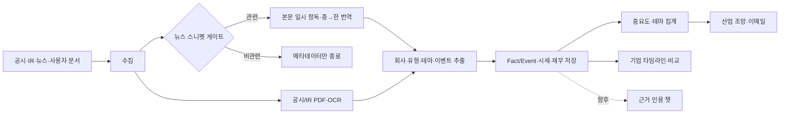

# 중국 이차전지 인텔리전스 서비스 PRD

## 1. 제품 개요

한국 양극재·음극재 소재사의 시장조사 담당자를 위한 사내 인텔리전스 도구다. 중국 이차전지 소재·셀 시장의 중국어 공시·IR·언론·사용자 제공 자료를 매일 수집·정독·번역·정제한다. 사용자는 산업 전체의 일일 조망과 추적 기업의 시계열 분석·비교를 통해 재무·기술·사업 방향을 파악한다.

### 제품 원칙

- 링크 집계가 아니라 **정독 결과 기반 사실과 이벤트**를 축적한다.
- 공식 공시·회사 IR을 최우선 출처로 하며, 모든 분석과 답변은 출처를 표시한다.
- 사실, 해석, 추정을 구분한다. 근거가 없으면 답하지 않는다.
- 중국어·영문 원문은 일시 취득해 정독하지만, 뉴스 본문은 영구 저장하거나 외부에 재배포하지 않는다. 제목·링크·발행일·매체·자체 한국어 요약만 저장한다.
- 사용자에게 보이는 모든 텍스트는 한국어이며, 무료 공개 소스부터 시작한다.

## 2. 사용자와 목표

| 사용자 | 핵심 과업 | 성공 기준 |
| --- | --- | --- |
| 배터리 산업 분석가 | 매일 중요 변화를 빠르게 파악 | 10분 이내로 핵심 이벤트와 근거 확인 |
| 사업·전략 담당자 | 특정 기업의 투자·기술·고객 전략 추적 | 시계열에서 전략 변화와 근거 문서 탐색 |
| 경영진 | 산업 변화를 짧고 신뢰도 있게 보고받음 | 일일 조망에서 의사결정 이슈 확인 |
| 관리자 1인 | 회사·테마·수동 자료 관리 | 자료 업로드·분류 수정·실행 로그 확인 |

## 3. 범위

### 포함

- 산업 조망: 양극·음극 소재 중심으로 셀사, 정책·시장, 전구체·전해질·분리막을 맥락으로 포착
- 회사 분석: 중국 셀사와 양극·음극 소재사만 추적 Universe로 관리; 기업의 복수 유형 태그 허용
- 공식 공시, 거래소 공시, 회사 IR, 공개 뉴스 RSS/웹, 사용자 업로드 문서(특허 목록·판매량·캐파 등)
- 산업 조망 대시보드, 기업 상세·타임라인, 2~5개사 비교, 최소 인증과 관리자 기능
- 공시/IR 파일 및 추출 텍스트, 뉴스 메타데이터·자체 한국어 요약, 구조화 사실·이벤트 보관

### 제외 (MVP)

- 비중국 소재사·셀사, OEM의 독립 추적, 광산·제련·장비 분석
- 인접 소재사의 회사 페이지·재무 비교
- 실시간 매매·투자 추천·목표주가 제시
- 저작권 허가 없는 뉴스 전문 저장·재배포
- 챗, 관계도, 정기 PDF 보고서: 두 핵심 기능 검증 후 별도 결정

## 4. 핵심 사용자 흐름

## 5. 기능 요구사항

### F1. 일일 수집·정독·번역

- 매일 스케줄에 따라 소스별 신규 문서를 수집한다.
- Daily 첫 화면은 (1) LLM 기반 1페이지 일일 보고서, (2) 전체 수집 뉴스에서 본문 정독·검증을 통과한 중요도 Top 10, (3) 회사별 승인 뉴스 순서로 표시한다. 소재별 뉴스 피드는 Daily의 1차 탐색 구조로 사용하지 않는다.
- Top 10의 각 항목에는 원문 링크, 원문 확인 상태, 한국어 팩트 요약, 선정 근거와 출처 신뢰도를 표시한다.
- Top 10 아래에는 Top 10 외 승인 주요 뉴스를 포함한 헤드라인 기반 Sankey 다이어그램을 표시한다. 회사 → 사건 유형 → 산업 신호의 연결은 추출된 헤드라인 태그를 집계한 결과이며, 모델의 전망·인과 해석을 추가하지 않는다.
- 공시/IR은 원문 URL, 수집 시각, 발행 시각, 원문 파일/PDF, 추출 텍스트, 해시를 저장한다.
- 뉴스는 중국어·영어 등 원문 언어와 무관하게 스니펫으로 관련성·회사 후보를 1차 판정하고, 통과분만 본문을 일시 취득해 정독·번역한다. 뉴스 DB에는 원문 제목·원문 언어·링크·발행일·매체·한국어 요약만 남기며, 본문은 처리 후 폐기한다.
- 회사명·중문명·영문명·거래소 코드·별칭을 기준으로 기업을 하나의 정규 ID에 매칭하고, 화면에는 통일된 한국어 표시명(예: 닝더스다이(CATL))을 사용한다.
- 동일 문서의 재게시·기사 전재를 감지하고 하나의 Canonical Document로 연결한다.

### F2. 사실·이벤트 추출

- 문서에서 회사, 날짜, 금액, 생산능력, 제품, 지역, 고객, 기술, 출처 구간을 추출한다.
- 이벤트 유형은 실적, CAPEX/증설, 가동, 수주·고객, JV/M&A, 제품·기술, 특허, 가격·원가, 정책·규제, 리스크로 분류한다.
- 하나의 이벤트에 복수 문서를 연결하고, 상충되는 내용은 병합하지 않고 상태로 표시한다.

### F3. 일일 리포트

- 매일 산업 전체와 셀/양극재/음극재별 핵심 이벤트를 한국어로 요약한다.
- 중요도는 영향 규모, 확정성, 신규성, 경쟁 파급, 재무 영향, 출처 신뢰도로 산정한다.
- 요약 문장마다 적어도 하나의 출처를 연결한다.
- 첫 화면에는 오늘의 동향, 테마·키워드 추이(1년/6개월/3개월/1개월), 유형별 핵심 기사 피드를 표시한다.
- 테마 시계열은 초기 조사값 `seeded`와 실수집값 `measured`를 구분한다. 이메일에는 한국어 요약과 원문 링크만 보낸다.

### F4. 기업 페이지

- 기업의 이벤트를 **시장**과 **기술** 두 개의 독립 시계열로 표시한다. 두 시계열은 같은 시간축에서 나란히 볼 수 있어야 한다.
- 기업의 기본 조회 범위는 최소 최근 3년부터 현재까지이며, 3년 전·1년 전·현재의 세 개 요약 스냅샷으로 축소하지 않는다. 출처가 확인된 주요 이벤트를 연속적으로 표시한다.
- 시장 시계열에는 가격·마진·출하·수주·생산능력·가동·고객·중국 내수/해외 지역·투자·재무 팩트를 표시한다.
- 시장 이벤트는 `수급·실적`, `투자·생산기반`, `고객·상업화`, `지역·해외전략`의 4개 레이어 중 주된 레이어에 분류한다. 사용자는 한 레이어만 필터링해 같은 성격의 이벤트를 시간순으로 비교할 수 있어야 한다.
- 기업 페이지의 기본 시계열 표현은 레이어를 행, 시기를 열로 하는 매트릭스다. 시장 4개 레이어와 기술 레이어를 같은 연도 축에서 좌→우로 표시해, 각 레이어의 기간별 사실을 직접 비교한다. 화살표·방향성 표기는 후속 단계에서만 추가한다.
- 기업 시계열은 현재 선택 기업 기준으로 Excel로 내보낼 수 있어야 하며, 회사·구분·레이어·시기·발생일·주요 사실·상세를 포함한다. 표준 `.xlsx` 생성이 가능한 환경에서는 `.xlsx`, 그렇지 않으면 Excel 호환 `.xls`로 제공한다.
- 기업 비교는 두 기업을 좌·우에 배치하고, 중앙의 공통 시간축을 아래(과거)에서 위(최근)로 읽는 형태로 표시한다. 시장·기술·세부 레이어는 비교 화면에서 분리 표기하지 않고, 각 날짜의 출처 확인 이벤트를 같은 높이에 배치한다.
- 기술 시계열에는 화학계·소재·공정·성능·특허·표준·출처가 명시한 개발·인증·양산·출하 팩트를 표시한다. AI가 기술 성숙도나 성공 가능성을 추정하지 않는다.
- 사용자는 시장 하락과 기술 전진, 또는 그 반대처럼 두 축의 디커플링을 같은 시간축에서 확인할 수 있어야 한다.
- 기간·이벤트 유형·신뢰도·출처로 필터링한다.
- “전략 변화”는 근거 이벤트 묶음과 함께 표시한다.
- 상장사는 일별 시세·시가총액·분기 재무·공시를, 비상장사는 `재무 미공개`를 표시한다. 주가 차트에 시장 이벤트 마커를 겹쳐 표시한다.

### 시장/기술 2축을 쓰는 이유

- 중국 소재사는 시장에서 가격·마진·가동률이 악화되는 동안에도 LMFP·나트륨·실리콘 음극 등의 기술 투자를 진행할 수 있다. 두 축의 차이가 기업 궤적을 보여주는 신호다.
- 기술의 특허·파일럿·인증은 출하·수주 같은 시장 결과보다 1~3년 선행할 수 있다. 단일 타임라인은 이 리드-래그 구조를 숨긴다.
- 한국 소재사 관점에서 가격·물량 경쟁 위협과 기술 격차 위협은 서로 다른 대응을 요구한다. 제품은 두 위협을 분리해 팩트로 보여준다.

### F5. 기업 비교

- 사용자는 2~5개사를 선택해 정규화 주가 수익률과 이벤트 타임라인을 비교한다.
- 셀사와 소재사 간 교차 비교를 허용한다. 캐파·출하량처럼 일부 기업만 보유한 지표는 해당 기업에 한해 표시한다.

### F6. 인증·관리자

- 회사 이메일 OTP와 마스터키 세션으로 사내 사용자(초기 20명 이하)를 인증한다.
- 관리자는 기업·테마를 관리하고 판매량·캐파·특허 목록 파일을 업로드하며 오분류를 수정한다.

### 향후: 근거 인용 챗

챗은 Phase 3 후보 기능이다. 내부 Event/Fact와 공시·IR 인용 구간을 우선 검색하며, 사용자가 명시한 경우에만 허용된 웹 검색으로 최신성을 대조한다. 답변은 결론·근거·상충 또는 불확실성·출처를 구분한다.

## 6. 초기 대상 기업

초기 Universe는 `companies.yaml`로 관리한다. 각 기업에 법인명·한/중/영문명·종목코드·상장시장·복수 유형 태그·별칭·상장 여부·웹 도메인을 등록한다.

- 셀: CATL, BYD, EVE Energy, CALB, Gotion, Sunwoda, Hithium, REPT Battero, SVOLT, Farasis
- 양극: Ronbay, Hunan Yuneng, Dynanonic, XTC, Easpring, Zhenhua, Changyuan Lico, Wanrun, Lopal, Reshine, Bamo, Rongtong
- 음극: BTR, Shanshan, Putailai, Zhongke Electric, Shangtai, Xiangfenghua, Kaijin, Hebei Kuntian, Carbon One

티커·상장 여부·지배구조가 불확실한 항목(예: Hithium, Reshine)은 Phase 0.5에서 실측 검증한다. 비상장 및 자회사형 소재사는 독립 재무 공백을 허용하고 모회사 연결 공시와 정성 이벤트로 보완한다.

## 7. 데이터 소스

| 역할 | MVP 소스 | 제약 |
| --- | --- | --- |
| A주 시세·재무 | AKShare | 상류 포맷 변경 가능성; 버전 고정·백오프 |
| A주 공시 | CNINFO | PDF 비정형·IP throttling |
| H주 공시 | HKEXnews | 검색 JSON·공식 PDF 링크 활용 |
| 뉴스 | 36kr RSS, Google News zh-CN, CnEVPost | 뉴스 본문 영속 저장 금지 |
| 보조 산업 뉴스 | GGII, WeChat 公众号 | RSS/API 부재·반크롤링으로 보조 역할 |
| 수동 자료 | 특허·출하·점유·캐파 파일 | 유료 원데이터·비상장 재무 공백 보완 |

유료 뉴스·공시 API는 비용·약관 검토와 발주자 승인 전에는 연결하지 않는다. 무료 RSS와 공식 IR/공시 페이지를 우선 사용한다.

## 8. 품질·운영 요구사항

- 공식 공시/IR 문서는 수집 실패 시 재시도하고 실패 내역을 기록한다.
- 날짜, 통화, 단위(GWh·톤·CNY 등), 분기 기준을 정규화하되 원문 값도 보존한다.
- 뉴스 전문의 외부 노출은 소스 약관·저작권 정책을 따른다. 외부 화면은 요약과 원문 링크 중심으로 한다.
- 모델이 생성한 요약·분류·번역은 버전, 프롬프트, 생성 시각을 기록한다.
- 소재·화학 전문용어 사전을 프롬프트에 적용하고 LLM 공급자·모델은 환경변수로 교체 가능하게 한다.
- 시장과 기술은 별도 시계열로 분류하되, 동일 이벤트가 두 축 모두에 관련될 경우 출처와 연결 관계를 유지한 채 양쪽에 표시한다.
- 소스 한 곳의 장애가 전체 실행을 막지 않으며, 실행·오류·재시도 이력은 보관한다.

## 9. 단계별 완료 기준

1. Phase 1: 일일 수집·2단계 정독·번역·산업 조망을 구현한다. 상장 추적기업의 시세·재무·공시는 과거 3년을 백필하고, 뉴스는 런칭일부터 축적한다. 같은 날짜 재실행 시 중복이 없어야 하며 3일 연속 무인 실행에 성공해야 한다.
2. Phase 2: 기업 페이지·2~5개사 비교·관리자 업로드·재분류를 제공한다.
3. Phase 3: 사용자가 Phase 1~2의 효용을 확인한 뒤 근거 인용 챗, 관계도, 정기 보고서의 착수를 결정한다.
